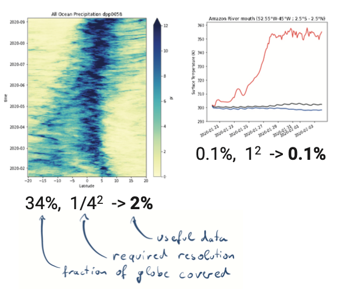

# Datasets

## Datasets are

)](dataset.png)

:::: {.columns}

::: {.column width="50%"}
* n-dimensional variables
* shared dimensions
:::

::: {.column width="50%"}
* coordinates
* attributes for metadata
:::

::::

## Datasets are not

* a single file
* a storage format
* shaped by storage & handling

::: {.notes}
In the past, people often designed datasets to match their file handling requirements.
The resulting view on a dataset seems to be overly restrictive and leads to unfortunate usage patterns.
:::

# Storage and access

## Access to subsets

:::: {.columns}

::: {.column width="50%"}

:::

::: {.column width="50%"}

:::

::::

Without subset access and hierarchies, analysis scripts are **forced** to load way too much data.

## Align the ordering of data with read patterns

](https://www.unidata.ucar.edu/blog_content/images/2013/blog_rew_chunking.png)

Make a compromise that's okay-ish for everybody by chunking along all dimensions.

## Compress small chunks

* Any access will require uncompressing entire chunks. 
* By keeping them small to reduce the amount of data that will be uncompressed but not used.
* Keep them big enough for the compressor to do its job.
* Usually MB-ish blocks are a good compromise.

# Mapping a dataset to files

## Contents of a dataset

* Metadata
* n-d variables consisting of many numbers (floats)

## Zarr is as simple as it gets.

* .json files for the metadata
* binary files for compressed chunks

As chunks are stored separately, this scales for any size of dataset. We are working with a 500 TB dataset in nextGEMS.

## netCDF4 / HDF5

* *netCDF4*, a.k.a. HDF5 stores metadata and chunks in one file.
* Usually a dataset is split across many of these files.
* Loading the dataset requires opening all files.[^1]

[^1]: There is the option of multi-file netCDF4/HDF5, but I have not seen this in practice.

## Kerchunk + fsspec

* We can index a multi-file HDF5 dataset with [kerchunk](https://github.com/fsspec/kerchunk), and then create a pseudo-filesystem zarr with [fsspec](https://github.com/fsspec) in python.
* Allows to treat a set of netCDF4 files as one zarr dataset.
* Direct access only via python.
* A simple python web server can present it as zarr via https for other languages.

# Appendix

## Performance benchmarks for chunking

:::{.smaller}

Storage layout, chunk shapes |	Read time series (sec) 	| Read spatial slice (sec) 	| Performance bias (slowest / fastest) |
|--------------|------|-----|-----|
|Contiguous favoring time range|  	0.013 | 	180| 	14000|
|Contiguous favoring spatial slice 	|200 |	0.012 |	17000|
|Default (all axes equal) chunks, 4673 x 12 x 16 | 	1.4 |	34 |	24|
|36 KB chunks, 92 x 9 x 11 |	2.4 | 1.7| 1.4|
|8 KB chunks, 46 x 6 x 8 |	1.4 |	1.1 |	1.2|

[source: unidata blog](https://www.unidata.ucar.edu/blogs/developer/entry/chunking_data_why_it_matters)

:::